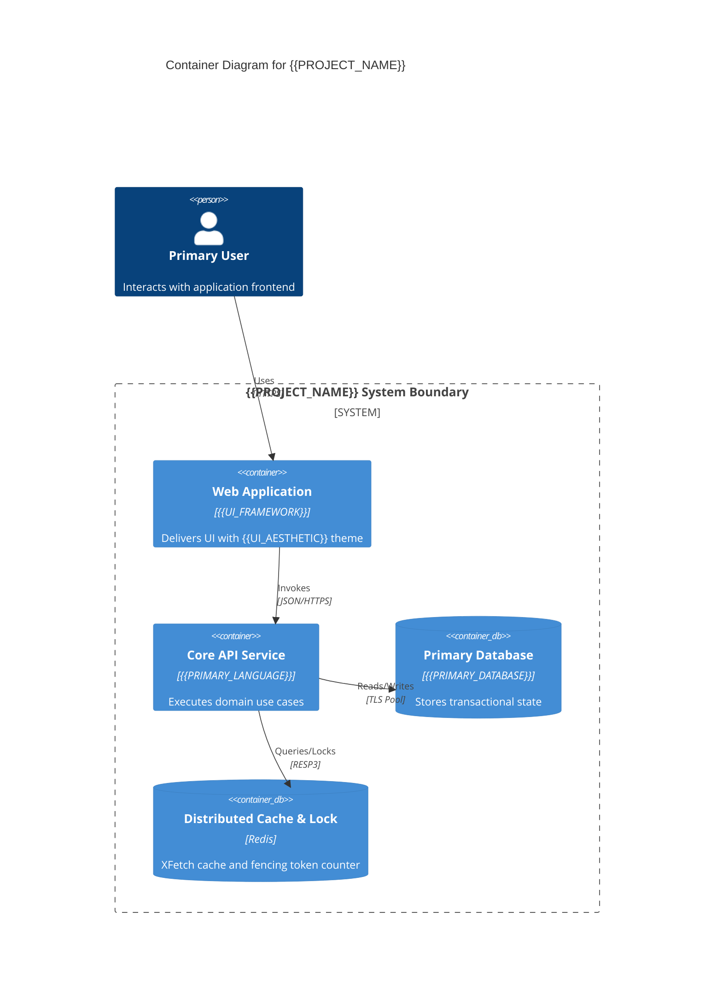

# C4 Container Diagram Template: {{PROJECT_NAME}}

```mermaid
C4Container
    title Container Diagram for {{PROJECT_NAME}}
    Person(user, "Primary User", "Interacts with application frontend")
    System_Boundary(sys, "{{PROJECT_NAME}} System Boundary") {
        Container(web, "Web Application", "{{UI_FRAMEWORK}}", "Delivers UI with {{UI_AESTHETIC}} theme")
        Container(api, "Core API Service", "{{PRIMARY_LANGUAGE}}", "Executes domain use cases")
        ContainerDb(db, "Primary Database", "{{PRIMARY_DATABASE}}", "Stores transactional state")
        ContainerDb(cache, "Distributed Cache & Lock", "Redis", "XFetch cache and fencing token counter")
    }
    Rel(user, web, "Uses", "HTTPS")
    Rel(web, api, "Invokes", "JSON/HTTPS")
    Rel(api, db, "Reads/Writes", "TLS Pool")
    Rel(api, cache, "Queries/Locks", "RESP3")
```
