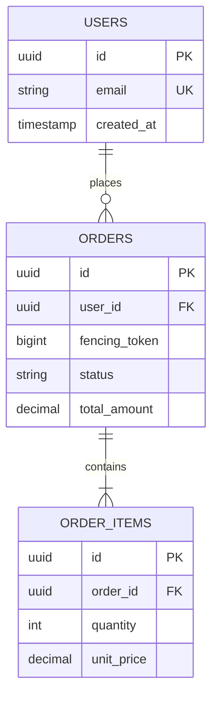

# Entity-Relationship Diagram (ERD) Template: {{PROJECT_NAME}}

```mermaid
erDiagram
    USERS ||--o{ ORDERS : places
    ORDERS ||--|{ ORDER_ITEMS : contains
    USERS {
        uuid id PK
        string email UK
        timestamp created_at
    }
    ORDERS {
        uuid id PK
        uuid user_id FK
        bigint fencing_token
        string status
        decimal total_amount
    }
    ORDER_ITEMS {
        uuid id PK
        uuid order_id FK
        int quantity
        decimal unit_price
    }
```
