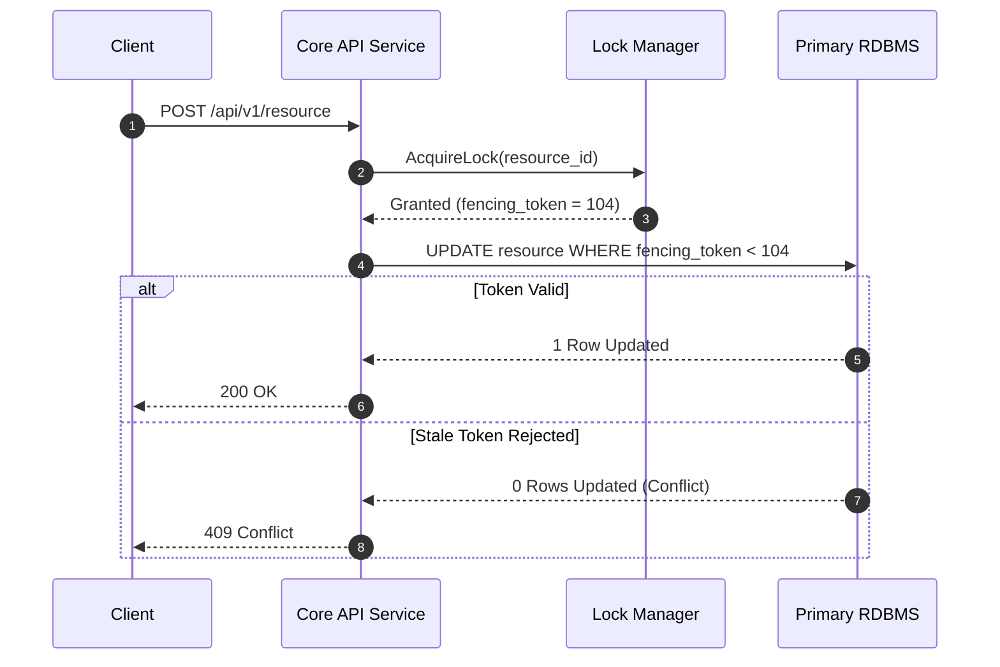

# Sequence Diagram Template: {{PROJECT_NAME}}

```mermaid
sequenceDiagram
    autonumber
    participant Client
    participant API as Core API Service
    participant Lock as Lock Manager
    participant DB as Primary RDBMS

    Client->>API: POST /api/v1/resource
    API->>Lock: AcquireLock(resource_id)
    Lock-->>API: Granted (fencing_token = 104)
    API->>DB: UPDATE resource WHERE fencing_token < 104
    alt Token Valid
        DB-->>API: 1 Row Updated
        API-->>Client: 200 OK
    else Stale Token Rejected
        DB-->>API: 0 Rows Updated (Conflict)
        API-->>Client: 409 Conflict
    end
```
